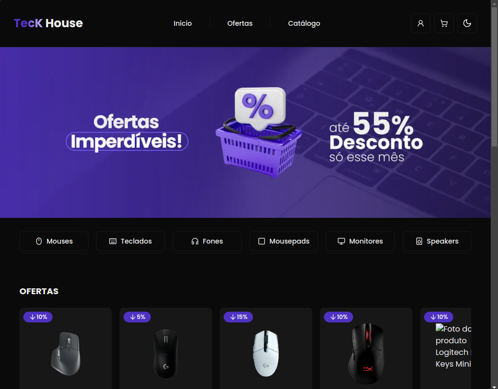
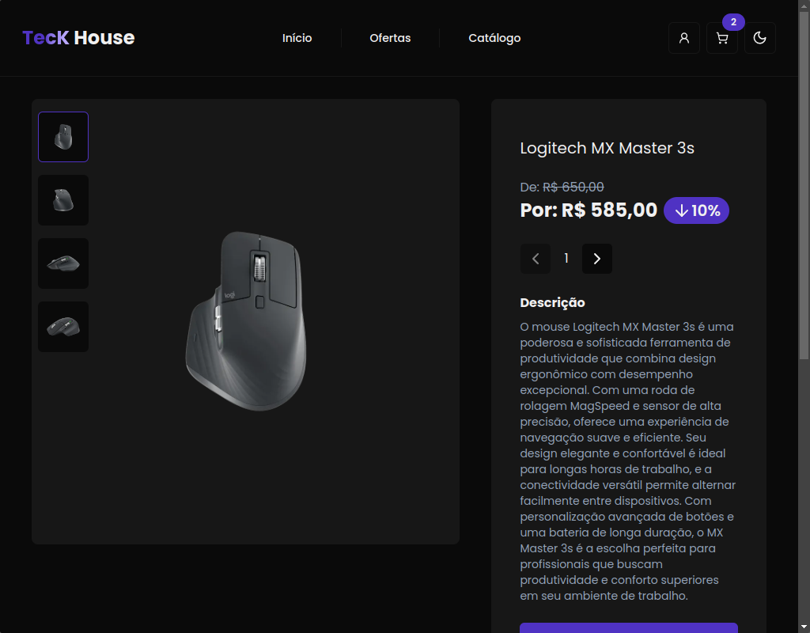
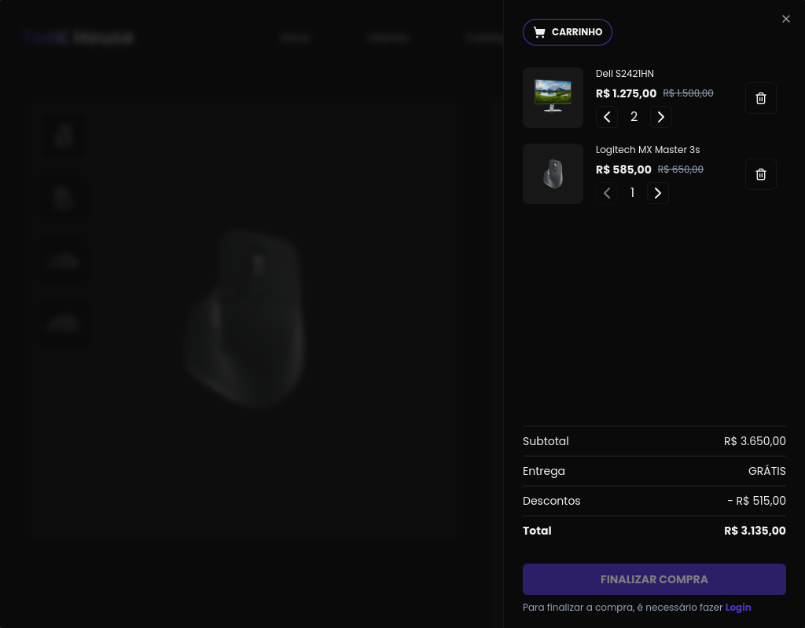
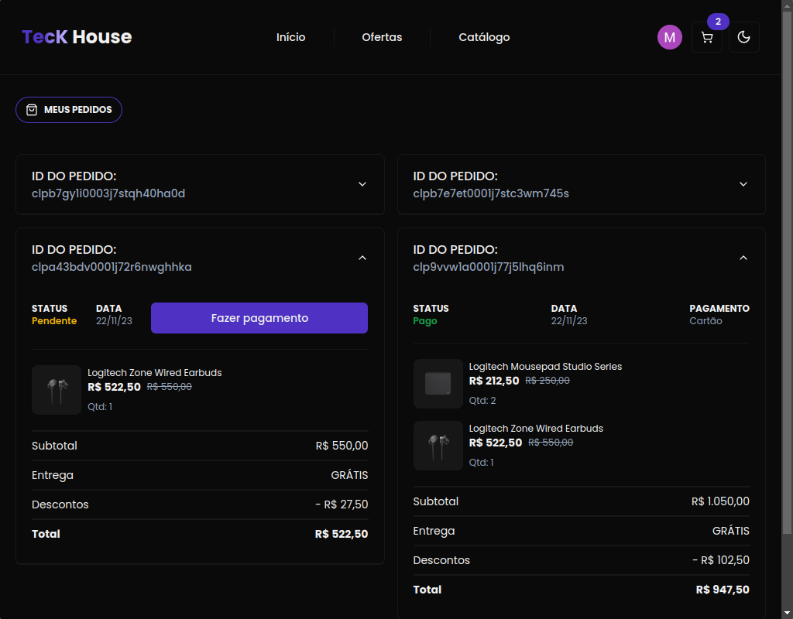

<!-- CABEÇALHO -->

    <h1 style="color:#4C31B7">
       🖱️ TecK House 🖱️
    </h1>
    

        <a href="#%EF%B8%8F-sobre-o-projeto">Sobre o Projeto</a> •
        <a href="#-funcionalidades">Funcionalidades</a> •
        <a href="#-layout">Layout</a> •
        <a href="#%EF%B8%8F-tecnologias">Tecnologias</a> •
        <a href="#-autor">Autor</a>
    

    
     
     

<!-- SOBRE O PROJETO -->

## 🖥️ Sobre o Projeto

> Projeto desenvolvido durante o evento [Full Stack Week](https://fullstackclub.com.br/fsw/) (10/23)

Teck House é um e-commerce focado em produtos eletrônicos.

Com ele é possível navegar por produtos, escolher um produto desejado, gerenciar seu carrinho de compras, fazer a compra de produtos e visualizar todos os seus pedidos.

O projeto foi desenvolvido utilizando TypeScript, Next.js, React, Tailwind CSS, Prisma, banco de dados PostgreSQL, entre outras tecnologias.

Além disso, a aplicação conta com autenticação através de conta do Google e integração de pagamentos via Stripe.

<!-- FUNCIONALIDADES -->

## 💡 Funcionalidades

- [x] Login com Conta Google
- [x] Exibição de produtos
- [x] Desconto em produtos
- [x] Página de detalhes do produto
- [x] Gerenciamento de carrinho de compras
- [x] Pagamento de pedido com API do Stripe
- [x] Gerenciamento de pedidos realizados

<!-- LAYOUT -->

## 🎨 Layout

> A aplicação tem como base o seguinte layout no [Figma](https://www.figma.com/file/yXjchWaZEP79Pu7xlZGv4H/FSW-Store?type=design&node-id=89%3A280&mode=design&t=DvUozbkbFV1d2Qbv-1)

  

  

  

<!-- TECNOLOGIAS -->

## 🛠️ Tecnologias

Para o desenvolvimento desse projeto, as seguintes ferramentas foram utilizadas:

- **[TypeScript](https://www.typescriptlang.org/)**
- **[React.js](https://pt-br.reactjs.org/)**
- **[Next.js](https://nextjs.org/)**
- **[Tailwind](https://tailwindcss.com/)**
- **[Shadcn UI](https://ui.shadcn.com/)**
- **[Zustand](https://docs.pmnd.rs/zustand/getting-started/introduction)**
- **[NextAuth](https://next-auth.js.org/)**
- **[Stripe](https://stripe.com/br)**
- **[Prisma](https://www.prisma.io/)**
- **[Supabase](https://supabase.com/)**
- **[PostgreSQL](https://www.postgresql.org/)**

## 👨‍💻 Autor

Marcos Kenji Kuribayashi

 

---

Desenvolvido por Marcos Kenji Kuribayashi 😉
